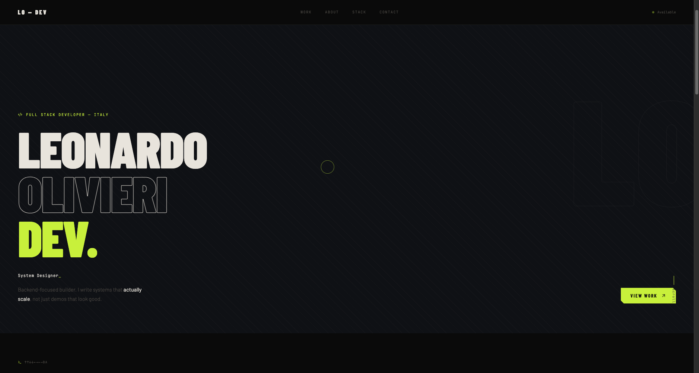

# Leonardo Olivieri — Portfolio

> Dark, minimal-industrial personal portfolio. Built with React + TypeScript + Vite.

**🔗 Live:** <!-- inserisci qui il link dopo il deploy su Vercel -->

---

## Preview

<!-- Dopo il deploy, sostituisci con uno screenshot reale:

-->

```
dark / minimal / industrial
↑↑↓↓←→←→BA  ← try this
```

---

## Stack

| | |
|---|---|
| Framework | React 18 + TypeScript |
| Bundler | Vite |
| Icons | Lucide React |
| Deploy | Vercel |
| Styling | CSS Custom Properties |

---

## Features

- **Typewriter** — cicla tra i ruoli nell'hero con cursore animato
- **Live age counter** — aggiornato ogni secondo al millisecondo
- **Custom cursor** — dot + ring con inerzia fluida
- **Project cards** — hover espande descrizione e stack
- **Scroll reveal** — ogni sezione entra con animazione
- **Active nav** — highlight della sezione corrente mentre scrolli
- **Terminal easter egg** — Konami code `↑↑↓↓←→←→BA` o click su `terminal` nel footer
- **Grain texture** — overlay sottile su tutto il sito
- **Responsive** — mobile ready

---

## Struttura

```
src/
├── App.tsx                  # layout principale e sezioni
├── main.tsx
├── styles/
│   └── global.css           # variabili CSS, reset, animazioni
├── types/
│   └── index.ts             # tipi TypeScript
├── data/
│   └── index.ts             # progetti, skills, costanti
├── hooks/
│   └── index.ts             # useMousePosition, useTypewriter, useLiveAge...
└── components/
    ├── Cursor.tsx
    ├── Nav.tsx
    ├── ProjectCard.tsx
    ├── SkillCard.tsx
    ├── Terminal.tsx
    └── UI.tsx               # Badge, SectionHeader
```

---

## Setup locale

```bash
git clone https://github.com/tuo-username/portfolio
cd portfolio
npm install
npm run dev
```

Build:

```bash
npm run build
```

---

## Deploy su Vercel

1. Push il repo su GitHub
2. Importa su [vercel.com](https://vercel.com) — detecta Vite automaticamente
3. Deploy in ~30 secondi

---

## Personalizzazione

Tutto il contenuto è centralizzato in `src/data/index.ts`:

```ts
// Cambia la tua data di nascita
export const BIRTH_DATE = 'YYYY-MM-DD'

// Aggiungi / modifica progetti
export const PROJECTS: Project[] = [ ... ]

// Modifica lo stack
export const SKILLS: Skill[] = [ ... ]

// Cambia i ruoli nel typewriter
export const ROLES: string[] = [ ... ]
```

Email e social link sono in `src/App.tsx` nella sezione Contact.

---

## Licenza

MIT — fai quello che vuoi, ma un credit è apprezzato.